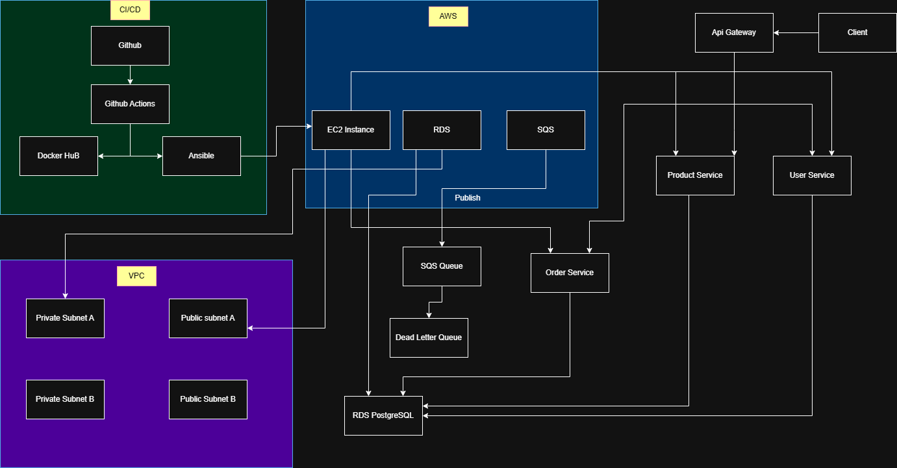
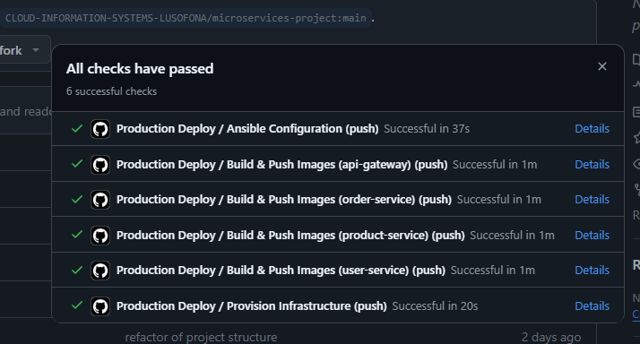

# Projeto Cloud

## Grupo

- Rodrigo Dias
- Pedro Cardoso

---

## Descrição

Projeto cloud com AWS.

Infraestrutura criada com Terraform.

Deploy automatizado com GitHub Actions.

Containers geridos com Docker.

Configuração com Ansible.

---


## Tecnologias

- AWS
- Terraform
- Docker
- Docker Compose
- Ansible
- GitHub Actions
- PostgreSQL (RDS)
- Amazon SQS

---

## Arquitetura



---

## Infraestrutura

### Componentes

- VPC personalizada
- 2 subnets públicas
- 2 subnets privadas
- EC2 (aplicação)
- RDS PostgreSQL
- SQS + DLQ

---

## Estrutura do Projeto

```text
.github/
├── workflows/
ansible/
└── playbooks/
docs/
└── images/
infrastructure/
└── terraform/
├── main.tf
├── outputs.tf
└── variables.tf
services/
├── api-gateway/
├── order-service/
├── product-service/
├── sanity-test/
└── user-service/

```
## CI/CD pipeline no GitHub Actions:

